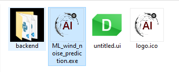

2.2 Starting WNPS 
=================

To start it in Windows operating system:

1. Go to directory

   .. code:: powershell

      Q:\tpvaero02\CFD\CFD_Methoden\PERSONAL\lsr\2_projects\7th_ML_noise_prediction\2nd_acute_UI\Platforms\Win

2. double click on the executable file (image below with blue shade):
   |image0|

To run it in Linux:

1. Open a terminal window.

2. Run the following command:

   .. code:: shell

      cd /tpvwork/tpvaero/tpvaero02/CFD/CFD_Methoden/PERSONAL/lsr/2_projects/7th_ML_noise_prediction/2nd_acute_UI/Platforms/Linux && ./ML_wind_noise_prediction &

.. warning::
    Note that it could take as long as 8 mins to start the app for the first time.

