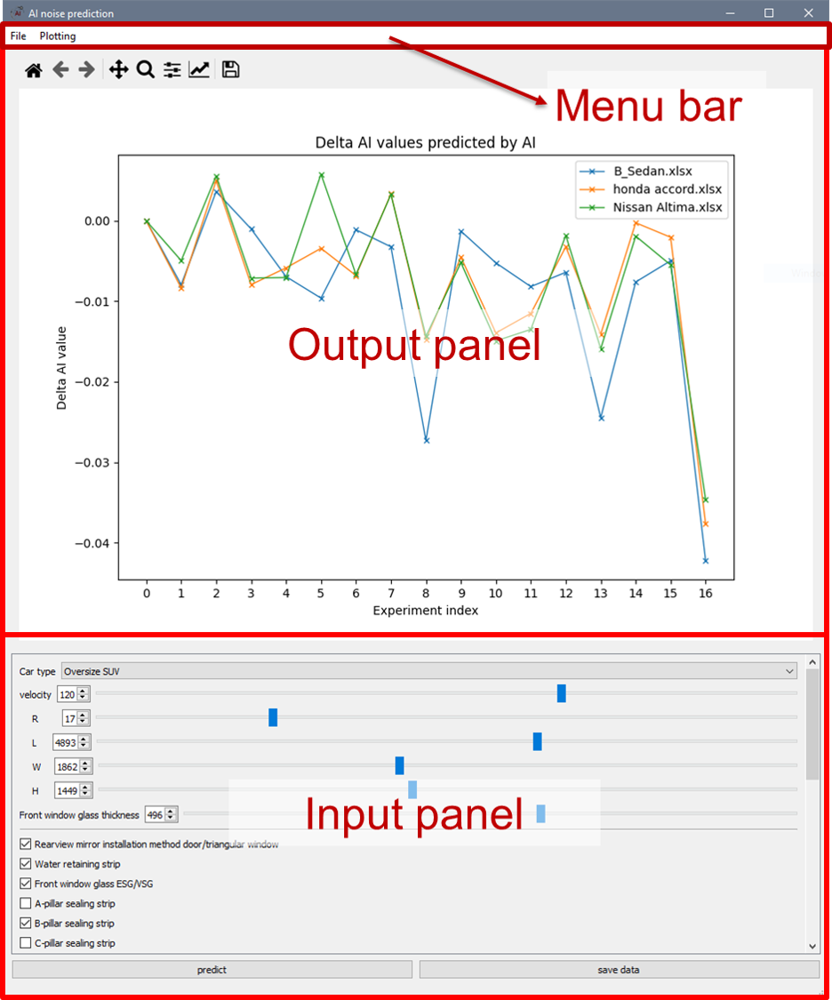

3.1. Graphical User Interface (GUI)
===================================

WNPS has a simple and user-friendly interface that consists of three
main parts:

-  The menu bar: This is located at the top of WNPS window and contains
   various options for accessing different functions and settings of
   WNPS.

-  | The input panel: This is located at the half bottom of WNPS window
     and allows you to enter or select 
   | the basic data of your experiment vehicle manually. At the bottom
     of it, there are buttons for predict and save data.

-  The output panel: This is located at upper half of WNPS window and
   displays your prediction results as an AI point and/or as a line
   chart. There is a sub menu bar on the top of the panel which allows
   you to change the chart such as pan/zoom etc.

Here is an example screenshot of WNPS interface:

|image0|

