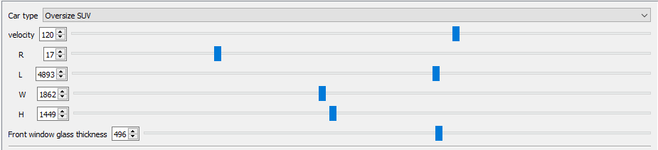
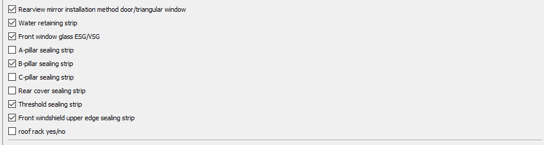
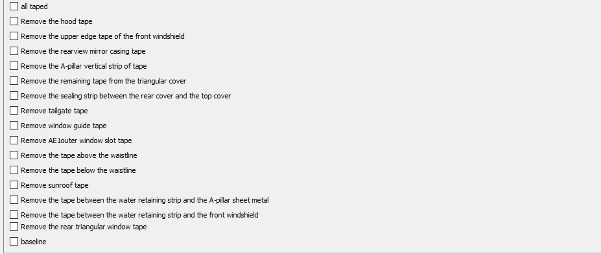

4.1 Manual input
================

The input panel of the Wind Noise Prediction Software (WNPS) is used for
performing virtual experiments. It contains three subsections: basic
info, wind-noise related configurations, and experiment status. The
basic info subsection allows the user to input information about the
vehicle being tested, such as its type and dimensions. The wind-noise
related configurations subsection allows the user to specify details
about the vehicle's design that may affect its wind noise performance.
The experiment status subsection allows the user to toggle different
settings for each virtual experiment.

When performing a series of experiments on one vehicle at one velocity
(to generate one AI line), the user only needs to set the first two
subsections once. Then, they can toggle the check boxes under the third
subsection several times to correspond with each virtual experiment.
This makes it easy for engineers to quickly test different
configurations and see how they affect wind noise performance.

+-------------------------+-----------------------------------+
| Input panel subsections | notes                             |
+=========================+===================================+
| |image0|                | basic info                        |
+-------------------------+-----------------------------------+
| |image1|                | wind-noise related configurations |
+-------------------------+-----------------------------------+
| |image2|                | experiments status                |
+-------------------------+-----------------------------------+

The input panel of the Wind Noise Prediction Software (WNPS) is an
essential tool for engineers who are working on vehicle design and
testing. By allowing them to input information about the vehicle and its
wind-noise related configurations, they can quickly and easily perform
virtual experiments to see how different design choices affect wind
noise performance. The experiment status subsection of the input panel
is particularly useful because it allows engineers to quickly toggle
between different settings for each virtual experiment. This means that
they can test multiple configurations in a short amount of time, without
having to manually input all of the information again.

Overall, the input panel of WNPS streamlines the process of performing
virtual wind noise experiments and helps engineers make informed
decisions about vehicle design.

