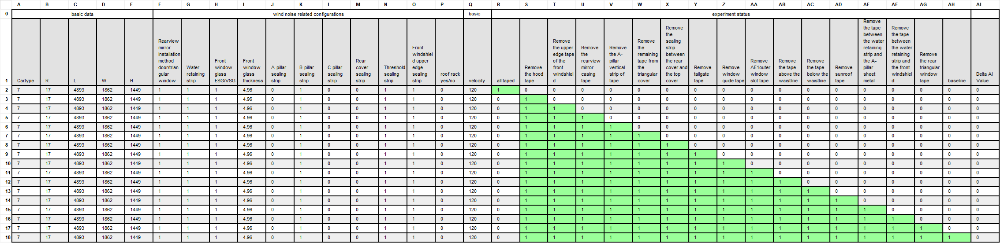

4.2. File input
===============

The input file of the Wind Noise Prediction Software (WNPS) is another
way for engineers to perform virtual experiments. As shown below, each
row in the input file represents one experiment, and each file results
in one series of experiments (one line).

|image0|

.. warning::
    One real input file should only contains cell ``A1`` to ``AI18``, other
    cells above are just the notations to the file.

Similar to the manual input panel, the input file contains 3 sections.

-  The basic data section (Columns A to E and Q ) contains information
   about the car type, dimensions (length, width and height), and
   velocity. The ``cartype`` column of the input file specifies the type
   of vehicle being tested. Different item numbers correspond to
   different types of vehicles. And the relationship is shown below.

   +-------------+-----------------------+
   | item number | corresponding cartype |
   +=============+=======================+
   | 0           | oversize SUV          |
   +-------------+-----------------------+
   | 1           | Compact SUV           |
   +-------------+-----------------------+
   | 2           | Compact Vehicle       |
   +-------------+-----------------------+
   | 3           | Mini size vehicle     |
   +-------------+-----------------------+
   | 4           | Middle large SUV      |
   +-------------+-----------------------+
   | 5           | Middle large vehicle  |
   +-------------+-----------------------+
   | 6           | Middle size SUV       |
   +-------------+-----------------------+
   | 7           | Middle size Vehicle   |
   +-------------+-----------------------+

-  The wind noise related configurations section (Columns F to P)
   contains information about rearview mirror installation method, water
   retaining strip, front window glass type and thickness, sealing
   strips for various parts of the car (A-pillar, B-pillar, C-pillar and
   rear cover), whether or not a roof rack is present etc. For
   True/False configuration, 1 means yes and 0 means no.

-  The experiment status section (Columns R to AH ) contains information
   about the removal of tape from various parts of the car during an
   experiment. With 1 means yes and 0 means no (shaded as green and
   white for illustration).

-  The Delta AI Value column does no effect to the result. Leave it to 0
   for convenience. After prediction, it is possible to overwrite this
   column with the predicted value.

For a normal series of virtual experiments, because the basic data and
wind noise configuration for one vehicle should not be changed, the data
of columns A to Q remains the same.

For the experiment status (Columns R to AH), first experiment is always
all taped. And with each following experiment, one new tape is removed.
At last, the last experiment removed all the tapes representing the
baseline status.

For example, in the above example file:

-  Experiment 1 (row 2): only cell ``R2`` is checked.

-  Experiment 2 (row 3): leave ``R3`` as 0 and check ``S3`` indicating
   that only the hood tape is removed.

-  Experiment 3 (row 4): ``S4``, ``T4`` are checked indicating that the
   hood tape remains removed, and a new tape (the upper edge tape of the
   front windshield) is removed compared with experiment1.

-  Experiment 4 (row 5): ``S5``, ``T5``, ``U5`` are checked indicating
   that a new tape (the rearview mirror casing tape) is removed compared
   with last experiment.

-  ...

-  Experiment 17 (row 18): ``S18``, ``T18``, ``U18``, ``V18``, ``W18``,
   ``X18``, ``Y18``, ``Z18``, ``AA18``, ``AB18``, ``AC18``, ``AD18``,
   ``AE18``, ``AF18``, ``AG18``\ are checked indicating all the tapes
   are removed, and therefore ``AH18`` is checked indicating the
   baseline status.

Overall, the input file provides a convenient way for engineers to
perform multiple virtual experiments at once. By specifying all of the
necessary information in a single file, they can quickly generate
multiple AI lines and compare wind noise performance across different
configurations.

