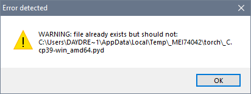
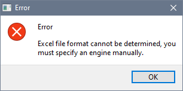
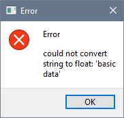
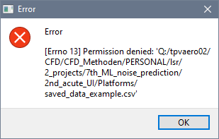

5.1. Problems
=============

Some common problems or errors that may occur while using WNPS are:

-  WNPS does not start or crashes: This may be caused by corrupted
   installation files, incompatible system settings, insufficient memory
   space etc. To fix this problem, try these solutions:

   -  Wait for another 5 mins.

   -  Quit and restart WNPS following Starting and Executing WNPS
      instructions above.

   -  Check if your computer meets minimum system requirements for
      running WNPS.

   -  Close other applications that may consume memory space before
      running WNPS.

   -  Contact technical support if problem persists.

-  Prediction process takes too long or fails: This may be caused by
   large input data size, network connection issues, server overload
   etc. To fix this problem, try these solutions:

   -  Reduce input data size by selecting fewer experiment statuses or
      removing unnecessary rows from data file.

   -  Contact technical support if problem persists.

A list of possible error messages is shown below:

+-----------------------------------+-----------------------------------+
| Error/warning examples            | Explanation                       |
+===================================+===================================+
|          |image0|                 | Just ignore it, it will not       |
|                                   | effect starting the program.      |
+-----------------------------------+-----------------------------------+
|           |image1|                | The input file is not in Excel    |
|                                   | format. Choose a valid file       |
|                                   | format.                           |
+-----------------------------------+-----------------------------------+
|                                   | The inputted Excel file is in     |
|           |image2|                | wrong format. Check the example   |
|                                   | file section to make sure the     |
|                                   | format is right.                  |
+-----------------------------------+-----------------------------------+
|                                   | The program has not enough        |
|                                   | permission to write to the csv    |
|                                   | data file. This happens normally  |
|           |image3|                | when the destination file is      |
|                                   | opened somewhere. Close this file |
|                                   | then try again.                   |
+-----------------------------------+-----------------------------------+

   